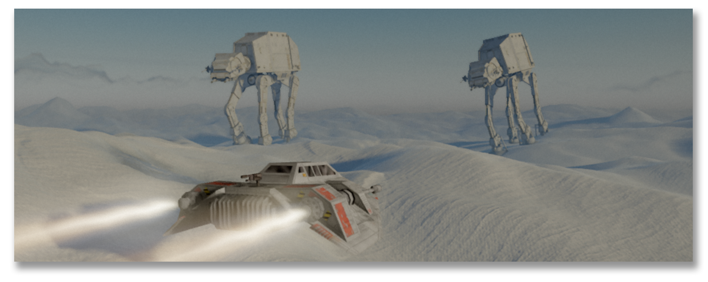

# Battle of Hoth Simulator



A real-time, flyable recreation of the **Battle of Hoth** — the opening battle
of *The Empire Strikes Back*. You are in the cockpit of a T-47 airspeeder,
skimming metres over procedural snow while AT-AT walkers advance across the
field, Imperial Star Destroyers hang on station high overhead, and an AI
wingman — or a ghost of your own recorded flying — runs passes beside you.

Source: <https://github.com/csanz/battle-of-the-hoth-simulator>

## The battle

Hoth is the Empire's answer to the destruction of the Death Star: the Rebel
Alliance found hiding on a frozen backwater, and General Veers' walkers landed
beyond the energy shield to take Echo Base the slow, unstoppable way — on
foot. The Rebels' snowspeeders were never going to kill an AT-AT with
blasters; the point of every pass was time — time for the transports to get
out. That is the scene this simulator lives in: the white field, the low sun,
the walkers coming on regardless, and a speeder that is faster than
everything and stronger than nothing.

What's simulated: terrain-hugging repulsorlift flight (thrust, brake/reverse,
boost, an E-latch cruise climb), cannons with tunable bolts that crater the
snow, walkers that march, track, and shoot back, deformable snow that
remembers every trench and impact, the fleet overhead, and a flight recorder
so the wingman can replay your own flying. Everything is tunable live from
the in-game overlay (backtick).

## Running it

```
npm install
npm run dev        # the battle
# /jet.html        # craft tuning page (overlay pre-opened)
```

Controls: **W** thrust · **S** brake / reverse · **A/D** steer ·
**Shift** boost · **E** climb / descend (latch) · **Space** fire ·
mouse look · wheel zoom · **`** overlay · **F2** copy the current
camera/player/herd as a pinnable opening shot.

## The engine

Three.js used strictly as a WebGL2 rasterizer: every shader is hand-written
GLSL (no Three materials, lights, shadows, or tonemapping), ported
line-for-line from the original's WGSL — clipmap terrain over GPU-baked
heightfields, a deformation simulation the snow remembers with, cascaded
shadow maps, a depth prepass feeding TAA/SSR/DoF, volumetric shafts, AgX
tonemapping. The full porting plan, binding contracts and per-subsystem specs
live under [`port/`](port/).

## Credits

- **The snow** — the rendering core is a full port of
  [**SNOWFLOW**](https://github.com/Noniv/snowflow_demo) by
  [**Noniv** (Maksymilian Dendura)](https://github.com/Noniv) (MIT), a
  Babylon.js/WebGPU real-time snow tech demo: the procedural terrain, sky,
  snow deformation, shading and post chain all originate in that work,
  translated wholesale to raw WebGL2/GLSL here.
- **The battle** — the Star Wars theme and the Battle of Hoth simulation on
  top of it (the flyable speeder, walkers in combat, the fleet, the wingman
  and the rest) by [Christian Sanz](https://github.com/csanz).
- **AT-AT walker** — baked conversion of
  [*"Imperial AT-AT Walker - Star Wars"* by **Quiznos323**](https://sketchfab.com/3d-models/imperial-at-at-walker-star-wars-7eab3f41da9143d8975b9034e91f8920)
  (Sketchfab), used under
  [CC BY-NC-SA 4.0](https://creativecommons.org/licenses/by-nc-sa/4.0/).
  That licence is **non-commercial, share-alike**, and covers the baked
  derivative in `public/models/` exactly as it covers the source `.glb`; it
  does not extend to the rest of this repository, but it does mean the demo
  cannot be used commercially while the model is in it.
- **T-47 snowspeeder** — fan-made community model, baked to
  `public/models/speeder.bin`. Its original author is not recorded in this
  repository's history; if that's you, open an issue and the credit lands
  here with a link.
- **Imperial-class Star Destroyer** — Sketchfab fan model
  (`star_wars_imperial-class_star_destroyer.glb`), decimated ~28× by
  grid-clustering (`tools/bakeDestroyer.mjs`) into `public/models/destroyer.bin`.
  Same note: author link welcome.

*Star Wars*, AT-AT, the T-47 and all related marks and designs are the
property of Lucasfilm Ltd. This is a non-commercial fan-made tech demo, not
affiliated with or endorsed by Lucasfilm.
